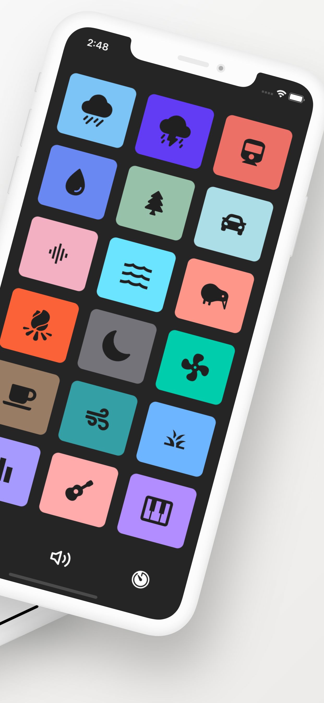
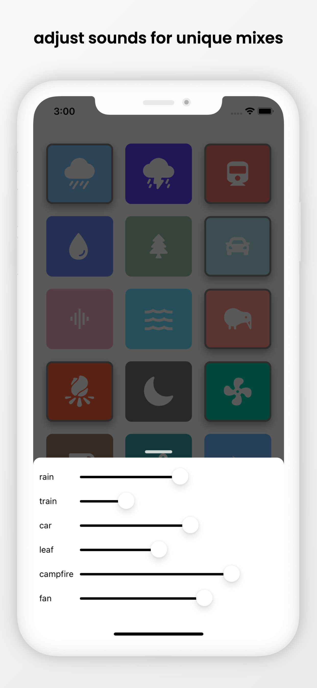
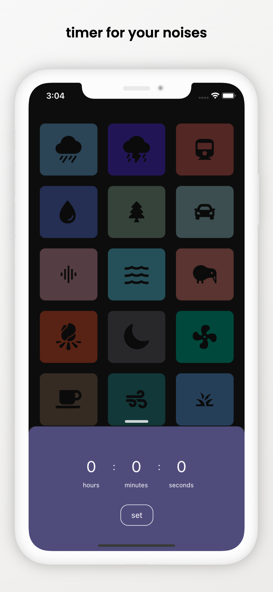

# Noisy

Noisy is a background noise generator designed to be simple and intuitive. 

    <kbd>
        
        
        
        
    </kbd>

## Tech

This is all written in TypeScript using the React Native framework.

The motivation behind React Native is that I wanted the application to be cross platform, as I tend to switch between Android and ios.

I went for React Native so that I could also sharpen my web-dev skills at the same time as building a fun app. 

## Motivation

Moving from Android to ios I found that there were no good free noise generators that mimicked what I had on Android. 

I wanted to build a free app that anyone could use, thus Noisy was born. 

## Assets 

The icons are from React-Native-Vector-Icons.

The sounds files are all from [freesound](https://freesound.org/). 
